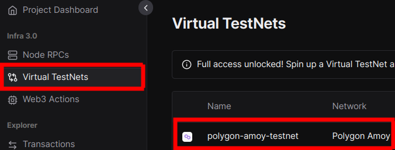
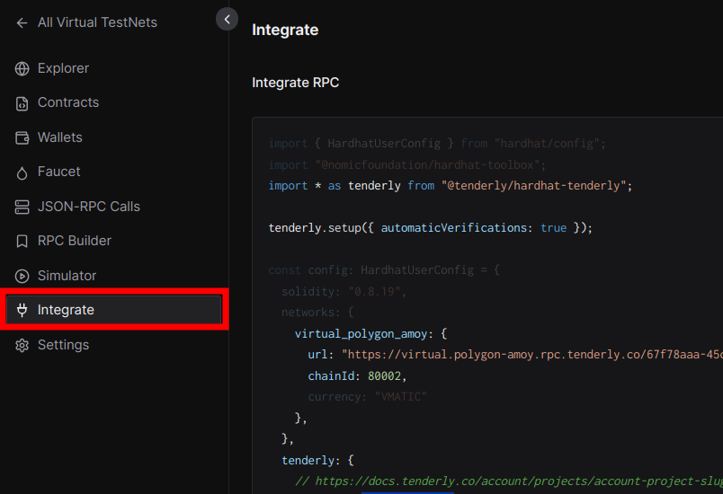
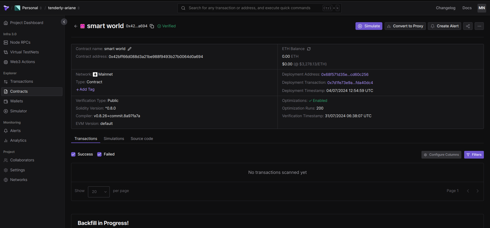
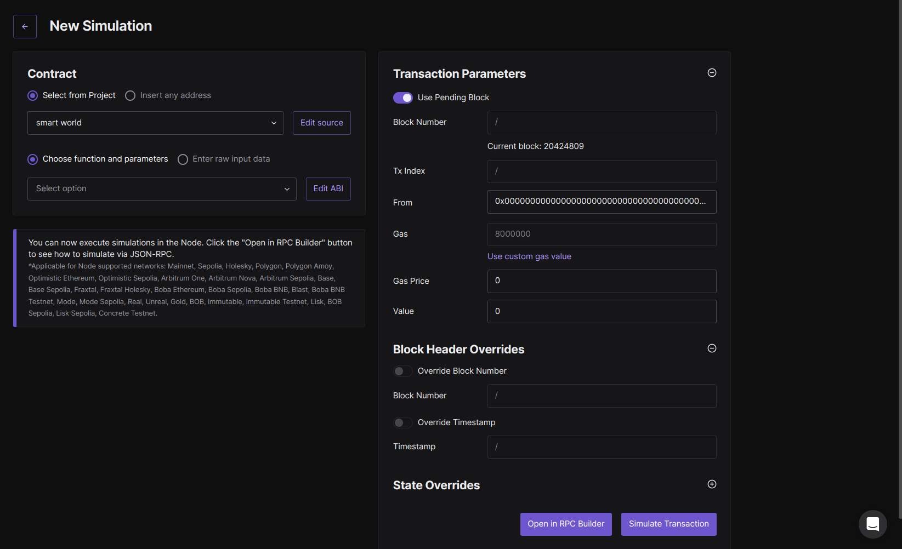
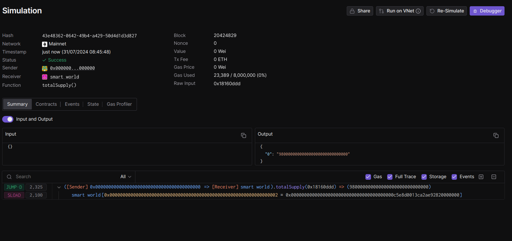
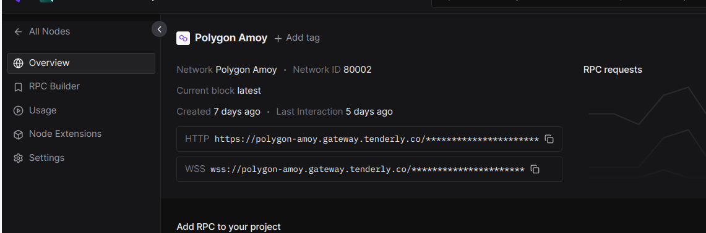

# Tenderly

This document aims to provide an overview of Tenderly platform features,
its limitations, and its usage, particularly in the context of working
with the Hedera network. Tenderly does not support networks that are
not integrated within its ecosystem, so all examples are based on the
networks that are already included.

# What is the Tenderly:

Tenderly is Full-Stack Web3 platform, designed to improve
upon development, on-chain deployment, debugging process, while simultaneously
providing multi-chain node RPC, integrated development environments and
any necessary infrastructure.


# Main Features:
## 1. Virtual TestNets/DevNets\Forks:
Simulated blockchain networks, designed to replicate real networks. During development process of this tool naming chainged 
from Forks to DevNets and later to TestNets (more scalable and performant solution), but all the names point to the same feature: 
ability to create snapshot of network that next may be tweaked, its internal state easily modified and observed.
### Usages:
- Local node replacement - code, test, and debug all components of dapps: smart contracts, dapp UI, backend, and indexing/data layer.
- Continuous integration infrastructure - allowing frequent integration of all dapp components and running automated tests.
- Staging infrastructure - that serves for purposes of manual testing, demoing, community testing, and contract auditing.
- Collaborative development infrastructure - allowing to develop dapps in iterations with minimal interference.

### Features and tools:
- TestNet Explorer: provides overview of transactions, contracts, wallets and RPC's on the TestNet
- Unlimited Faucet
- State Sync: real time sync of Virtual TestNet with state of parent network
- Transactions:
  - Send transaction
  - Simulate transaction
  - Debug transaction - this feature is currently work in progress 
- Contracts and wallets:
  - Deploy contracts
  - Verify contracts
  - Add TestNet as a provider to your Metamask wallet
- JSON RPC interface:
  - Admin RPC - full customization of TestNet environment
### Prerequisites:
#### 1. Hardhat or Foundry:
Tenderly has better integration with Hardhat due to the existence of the `@tenderly/hardhat-tenderly` plugin which streamlines the whole process.
The user doesn’t have to pass a private key for example - it’s done under the hood by the plugin. In Foundry all necessary parameters must be passed manually.
Tenderly tends to have similar problems with automatic smart contract verification with the newest versions of those frameworks (the most recent versions will not work).

Working Foundry config (foundry.toml) & call below:
```
[profile.default]
src = "src"
out = "out"
libs = ["lib"]
cbor_metadata = true

[etherscan]
# See more config options https://github.com/foundry-rs/foundry/blob/master/crates/config/README.md#all-options
unknown_chain = { key = "${ETHERSCAN_API_KEY}", chain = 1370, url = "${TENDERLY_VIRTUAL_TESTNET_RPC_URL}/verify/etherscan" }
```
```
export ETHERSCAN_API_KEY=[this should be a Tenderly access token]
export TENDERLY_VIRTUAL_TESTNET_RPC=https://virtual.polygon.rpc.tenderly.co/[UUID of the network]
export TENDERLY_VERIFIER_URL=$TENDERLY_VIRTUAL_TESTNET_RPC/verify/etherscan 
export PRIVATE_KEY=[sender's private key]
forge create \
--private-key $PRIVATE_KEY  \
--rpc-url $TENDERLY_VIRTUAL_TESTNET_RPC \
--etherscan-api-key $ETHERSCAN_API_KEY \
--verify \
--verifier-url $TENDERLY_VERIFIER_URL \
Counter
```
#### 2. Connect metamask client

#### 3. Setup Tenderly account:
- Create account on the Tenderly Platform
- Create Virtual TestNet with the network of your choice (recommended is custom chain ID)
- Add the network to the wallet
- Use Faucet in main menu to get some funds
#### 4. Setup of Tenderly Project (for the hardhat):
- create and get to project directory
- `npm init -y` - initialize node project

- `npm install --save-dev hardhat@2.22.0` - install hardhat dependency (make sure that hardhat is of version <= 2.22.0 - scripts directory should be present)

- `npx hardhat init` - initialize hardhat project
- `npm install --save-dev @tenderly/hardhat-tenderly` - install tenderly dependency
- Add this lines on the beginning of the `hardhat.cofig.ts` file
```Typescript
import * as tdly from "@tenderly/hardhat-tenderly";
tdly.setup();
```

also copy and paste `HardhatUserConfig` from Tenderly platform main menu:


- Login using tenderly CLI: `tenderly login`, generate Authorization Token in the Tenderly platform and paste it when prompted
- You may now use `npx hardhat run scripts/deploy.ts --network <your-network>` to deploy contract on <your-network> testNet, it will be visible
  under Contracts -> Virtual Contracts
## 2. Web3 Actions:
Automated serverless backend for the dapps - serve as programmable hooks for relevant on/off chain events.
### Usages:

- active monitoring and automate code responses to specific events
- combined with alerts, enable to create alert-response patterns for relevant on-chain changes
- allow to connect smart-contracts with off chain infrastructure: APIs, frontends and other services
- may improve UX by gathering and sharing important information through notifications

### Web3 Action Setup:
By documentation there are two main setup routes:
#### 1. Tenderly Portal
In the Project menu go to the Web3 Actions and follow up the steps:
- select trigger type,
- write javascript/typescript method that will be executed during the action
- define trigger parameters 
- write additional info like name and description for the action
- select one of the networks on which action will be executed and execution type: sequential or
parallel, sequential action trigger is done if order of triggering should be preserved or if there are bandwidth limitations
#### 2. Tenderly CLI

- initialize the action: `tenderly actions init` (select your project when prompted)
- you may modify `example.ts` in `/actions` directory, this will be logic that will be triggered upon action trigger
- 'tenderly.yaml' file specifies in what conditions action will be triggered:
```yaml
account_id: ''
project_slug: ''
actions:
  username/project-slug:
    runtime: v1
    sources: actions
    specs:
      block-number-printer:
        description: Example Web3 Action that logs block number once it is mined.
        function: example:blockHelloWorldFn
        trigger:
          type: block
          block:
            network:
              - 1
            blocks: 10
```
under project_slug you write down name of the project, under account_id, your account name
- deploy action with: `tenderly actions deploy

## 3. Alerts:
Alerts listen for events on the blockchain and sends real-time notifictations to desired destination when event occurs.
### Types of triggers:
- Successful Transaction - Notifies you when a successful transaction happens.
- Failed Transaction - Send a notification when a transition fails.
- Function Call - Fires when a specific function is called from a contract.
- Event Emitted - Triggers when a specific event is emitted from a contract.
- Event Parameter - Alerts you when an event parameter has a particular value. You can use this Alert trigger to monitor when a particular address is approved to transfer tokens on behalf of the owner.
- ERC20 Token Transfer - Triggers when an ERC20 transfer event is emitted from a contract, allowing you to track when you or someone moves tokens.
- Allowlisted Callers - Notifies you whenever an address from this list calls your contracts.
- Blocklisted Callers - Notifies you when an address that is not on this list calls your smart contract.
- Balance Change - Triggers when the network's native currency balance of an address matches conditions.
- Transaction Value - Notifies you when a transaction value matches set conditions. This alert is useful in situations when a transaction with more than a certain amount of ETH calls a contract.
- State Change - Fires when a state variable in a contract changes.
- View Function - Alerts you when a view function's return value matches certain criteria, passes a threshold, or changes by a certain percentage.

### Types of targets:
Define addresses that may trigger the alarm
- Address - only this address can trigger the alarm
- Network - all addresses deployed on the network may trigger the alarm
- Project - every address in the Tenderly project may trigger the alarm
- Tag - every address with the selected tag may trigger the alarm

### Alert Setup:
Alerts are possible to set up only from the Tenderly platform menu, and can be accessed under Monitoring - Alerts in main project menu, setting up alert involves following steps:
- Set the [trigger type](#types-of-triggers)
- Choose target
- Chose parameters: they depend on the target and trigger type
- Destination: What will be the outcome of the alert, you may select more than one destination
    - email
    - slack
    - telegram
    - discord
    - tenderly web3 action (note: possible to set up from the web3 action sub menu)
    - webhook
  
## 4. Gas profiler:
Provides insight into smart contract methods gas usage
- granular gas usage breakdown and analyze how each function call spends gas.
- identifies gas-intensive lines of code.
### How to use:
- add contract to the watched contracts, or transaction to watched transactions
- select transaction of interest
- from the transaction view you may select "Gas Profiler" from the menu on the upper part of main display.
- from the Gas Profiler menu you may choose to see any section of smart-contract stack trace, see the code in the debugger, how much
  gas was used on particular function call and also re-simulate the transaction (with changes to the source code)

## 5. Transaction Simulations: 
Transaction Simulations let you preview the exact outcome of a transaction before it is executed on the live network
### Types of transaction simulation:
- Single Transaction Simulation: test transaction without risking real assets and spending gas/money.
- Bundled Transaction Simulation: used for testing interdependent transactions.
### Use cases
- Asset and balance changes: Get exact dollar values for all balance and asset changes that will happen.
- Gas estimation: Accurately predict the gas costs before sending the transaction.
- State overrides: Modify blockchain conditions like timestamps and contract data to test different scenarios.
- Preview transaction outcomes: Identify and fix issues that could cause transactions to fail.
- Access lists: Create lists of addresses and storage slots the transaction will access.
- Human-readable errors: Get complex errors decoded into explanations that you can easily understand.
### How to use
#### Via Tenderly Platform: 
- Go to Contracts page, select or add contract for which you want to simulate transaction and press `Simulate`:

- Fill details for the transaction simulation details and press `Simulate Transaction`:

- Example result look as follows: 

#### Via RPC: 
You may call any RPC node in Tenderly 
to simulate transaction, example pressented below: 
```bash
curl https://mainnet.gateway.tenderly.co/$TENDERLY_NODE_ACCESS_KEY \
  -X POST \
  -H "Content-Type: application/json" \
  -d \
  '{
    "id": 0,
    "jsonrpc": "2.0",
    "method": "tenderly_simulateTransaction",
    "params": [
      {
        "from": "0xe2e2e2e2e2e2e2e2e2e2e2e2e2e2e2e2e2e2e2e2",
        "to": "0x6b175474e89094c44da98b954eedeac495271d0f",
        "gas": "0x7a1200",
        "gasPrice": "0x0",
        "value": "0x0",
        "data": "0x095ea7b3000000000000000000000000f1f1f1f1f1f1f1f1f1f1f1f1f1f1f1f1f1f1f1f1000000000000000000000000000000000000000000000000000000000000012b"
      },
      "0xfc497b"
    ]
  }'
```
Urls are available under: **Node RPC** > select node that you want to call > in main menu, url will be available

Example of the response: 
```json
{
  "id": 0,
  "jsonrpc": "2.0",
  "result": {
    "status": true,
    "gasUsed": "0xb412",
    "cumulativeGasUsed": "0xb412",
    "blockNumber": "0xfc497b",
    "type": "0x0",
    "logsBloom": "0x00000000000000000000000000000000000000000000000000000000000000000000000000000000000000000000000000000000000000000000000000200000000000000000000000000028000000000000000002000000000000000000000010000000000000000004000000000000000000000000000000000000000000000000000000000100000000000000000000000000000000000000000000000000020000000000000000000000000000000000000000000000000000000000000000000000000000000000000000000000000002000000000000000000000000000010000000000000000000000000040000000000000000000000000000800000",
    "logs": [
      {
        "name": "Approval",
        "anonymous": false,
        "inputs": [
          {
            "value": "0xe2e2e2e2e2e2e2e2e2e2e2e2e2e2e2e2e2e2e2e2",
            "type": "address",
            "name": "src",
            "indexed": true
          },
          {
            "value": "0xf1f1f1f1f1f1f1f1f1f1f1f1f1f1f1f1f1f1f1f1",
            "type": "address",
            "name": "guy",
            "indexed": true
          },
          {
            "value": "299",
            "type": "uint256",
            "name": "wad",
            "indexed": false
          }
        ],
        "raw": {
          "address": "0x6b175474e89094c44da98b954eedeac495271d0f",
          "topics": [
            "0x8c5be1e5ebec7d5bd14f71427d1e84f3dd0314c0f7b2291e5b200ac8c7c3b925",
            "0x000000000000000000000000e2e2e2e2e2e2e2e2e2e2e2e2e2e2e2e2e2e2e2e2",
            "0x000000000000000000000000f1f1f1f1f1f1f1f1f1f1f1f1f1f1f1f1f1f1f1f1"
          ],
          "data": "0x000000000000000000000000000000000000000000000000000000000000012b"
        }
      }
    ],
    "trace": [
      {
        "type": "CALL",
        "from": "0xe2e2e2e2e2e2e2e2e2e2e2e2e2e2e2e2e2e2e2e2",
        "to": "0x6b175474e89094c44da98b954eedeac495271d0f",
        "gas": "0x79bdb0",
        "gasUsed": "0x5fc2",
        "value": "0x0",
        "input": "0x095ea7b3000000000000000000000000f1f1f1f1f1f1f1f1f1f1f1f1f1f1f1f1f1f1f1f1000000000000000000000000000000000000000000000000000000000000012b",
        "decodedInput": [
          {
            "value": "0xf1f1f1f1f1f1f1f1f1f1f1f1f1f1f1f1f1f1f1f1",
            "type": "address",
            "name": "usr",
            "indexed": false
          },
          {
            "value": "299",
            "type": "uint256",
            "name": "wad",
            "indexed": false
          }
        ],
        "method": "approve",
        "output": "0x0000000000000000000000000000000000000000000000000000000000000001",
        "decodedOutput": [
          {
            "value": true,
            "type": "bool",
            "indexed": false
          }
        ],
        "subtraces": 0,
        "traceAddress": []
      }
    ]
  }
}
```
#### Via API:
Example may be found in the `hardhat-transaction-simulation-example`, project is setuped as normal, in `deploy.ts` scritp
Tenderly instance must be created, in it you define transaction details as well as destination. 
## Drawbacks, issues, disclaimers:
- chain id during TestNet creation: default one doesn't work
- there is no information how to setup alerts with web3 actions
- Alerts: Allowlist Callers and Blocklisted Callers have swapped alert description
- Gas profiler: there is a note that code may be optimized but there is no description how to do it (how to modify contract from the gas profiler or debugger sub menu) in the documentation.
- Transaction simulation via API is done diffrently than in documentation
- Alerts, Web3 Actions, Debugger, and Transaction Simulation are working only for Node RPC's not for Virtual TestNets
